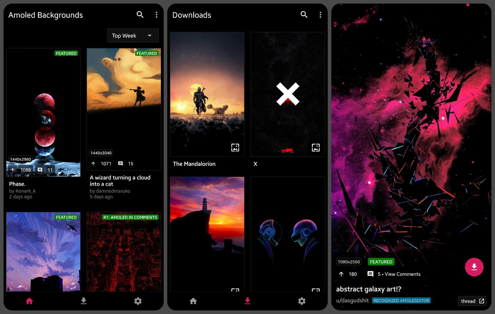

# AmoledBackgrounds for Android

AmoledBackgrounds provide an easy and quick way for users to get wallpapers from r/AmoledBackgrounds subreddit on popular Reddit platform.

 100k+ Downloads • 800+ Reviews • 4.2 ⭐ Average Rating

 

## Contribution

There are several ways you can contribute to this project:

1. Code Contributions: You can help us by writing code, fixing bugs, and implementing new features. Check out the Issues section for tasks that need attention or suggest your own improvements.

2. Bug Reports: If you encounter a bug while using [Repository Name], please report it in the Issues section. Be sure to include relevant details that can help us reproduce the issue.

3. Feature Requests: Have an idea for a new feature? Share it with us in the Issues section. We encourage discussions around potential enhancements to the project.

## License

MIT License. Please check [LICENSE.md](LICENSE.md) file for complete license.
